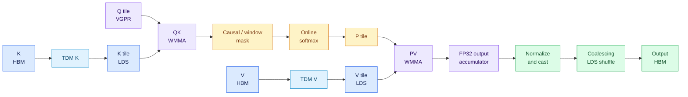
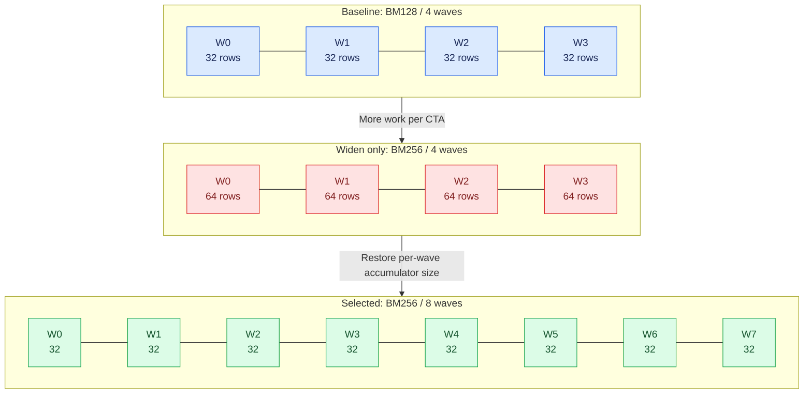
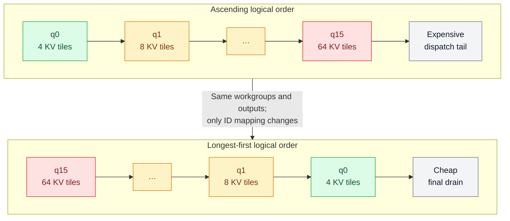
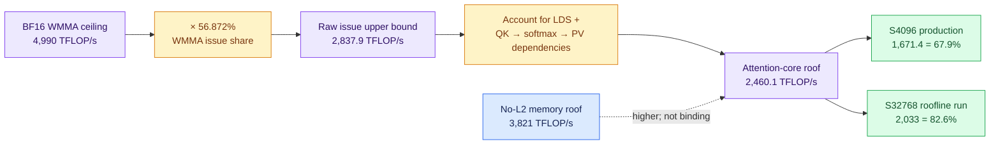
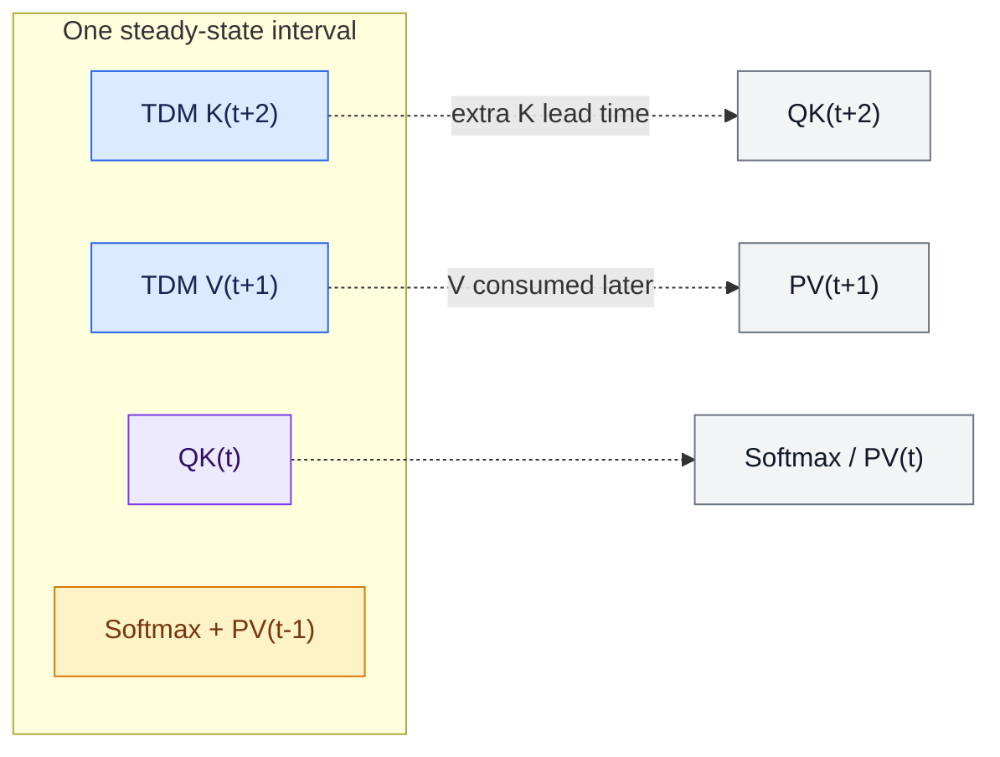
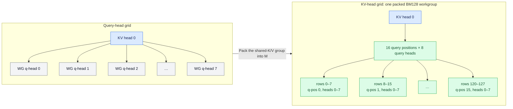
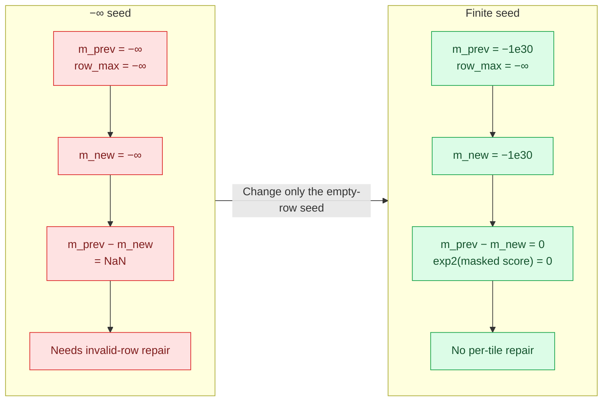
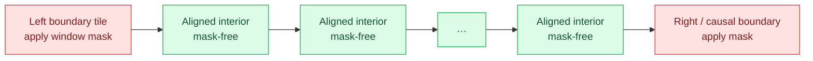

# Engineering a Faster FlashAttention Prefill Kernel on gfx1250

*Draft for technical review.*

## An evidence-driven journey through eight optimization-workstream PRs

This optimization workstream produced eight public pull requests for
TokenSpeed's gfx1250 Gluon MHA prefill kernel. Six changed performance; two
hardened the selector and test coverage. The work progressed from tile
geometry, through compiler and launch scheduling, to a deeper
K-ahead/V-behind pipeline and packed-GQA specializations for short, ragged, and
sliding-window attention.

These eight PRs are the optimization series, not the kernel's complete upstream
lineage. The implementation originally landed through
[#718](https://github.com/lightseekorg/tokenspeed/pull/718) and
[#719](https://github.com/lightseekorg/tokenspeed/pull/719), then received
generation-based organization in
[#880](https://github.com/lightseekorg/tokenspeed/pull/880), FP8 support in
[#953](https://github.com/lightseekorg/tokenspeed/pull/953), CDNA5 namespace
updates in [#1411](https://github.com/lightseekorg/tokenspeed/pull/1411), and
symbol naming updates in
[#1678](https://github.com/lightseekorg/tokenspeed/pull/1678).
A CI companion, [#1522](https://github.com/lightseekorg/tokenspeed/pull/1522),
moved the dedicated test path.

This article records what changed, what each change measured, what failed, and
why. Percentages from different campaigns are not added together. Cumulative
claims come only from experiments that replayed each policy on the same source,
toolchain, shape, and measurement protocol.

Across the separately reported campaigns:

* the public roofline campaign measured 2.033 PFLOP/s of useful causal work on
  B2/S32768/H8/KV1/D128 BF16 using TokenSpeed `5eea3c0ea9` with
  `3.8.10.post20260906`;
* a same-source/same-toolchain replay of
  [#1476](https://github.com/lightseekorg/tokenspeed/pull/1476),
  [#1496](https://github.com/lightseekorg/tokenspeed/pull/1496), and
  [#1505](https://github.com/lightseekorg/tokenspeed/pull/1505) produced an
  unweighted +31.60% mean across eight full-causal production-supplement rows;
* the combined
  [#1883](https://github.com/lightseekorg/tokenspeed/pull/1883)
  deep-pipeline/full-tile stack improved B4/S4096/H8/KV1 by 5.047-6.600% on
  the published compiler;
* candidate `986b7271` measured 2.69-69.15% above recorded main `a4178a9d`
  baselines on selected routes; these were separate, non-interleaved
  campaigns.

Those results came from specialization, not a universal fast path. Each
retained path has explicit eligibility guards. One important caveat is that
[#1924](https://github.com/lightseekorg/tokenspeed/pull/1924)'s ragged gate
accepts any nonuniform B4 batch with `max_seqlen == 4096`, while the reported
ragged performance uses one distribution:
`[4096, 3584, 2305, 1024]`.

## A mental model of the kernel

### Notation and hardware terms

| Term | Meaning |
|---|---|
| B / S | Batch size / sequence length |
| Hq / Hkv | Query-head count / KV-head count |
| D | Head dimension |
| BM / BN | Query-row tile / KV-row tile |
| MHA / GQA / MQA | Equal query/KV heads / grouped query heads / one KV head |
| CU | Compute unit |
| Wave | The 32-lane gfx1250 hardware execution group |
| Warp | The Triton/Gluon API term used by `num_warps`; on this target it maps to a wave32 |
| VGPR | Per-wave vector register allocation; excess live state causes spills |
| LDS | On-chip workgroup-shared memory |
| HBM | Off-chip high-bandwidth memory |
| TDM | Tensor data mover used for asynchronous global-to-LDS copies |
| WMMA | Matrix multiply-accumulate instruction |
| VALU | Vector arithmetic issue pipeline used by both WMMA and softmax/vector instructions |
| ILP | Instruction-level parallelism: independent instructions available for overlap |
| Online softmax | Streaming softmax that carries a running maximum and denominator across KV tiles |
| LSE | Optional log-sum-exp output |
| ATT | Instruction-level advanced thread trace |
| `mbarrier` | Memory barrier primitive used for explicit producer/consumer handshakes |
| coexec | Compiler scheduling strategy that co-schedules compute and memory work |

The easiest way to understand the optimizations is to follow one workgroup.
It owns a block of query rows and repeatedly walks blocks of K and V:

1. TDM moves a K or V block from global memory into LDS.
2. Waves load K from LDS and issue QK WMMAs.
3. The kernel applies causal or window masks and updates online softmax.
4. Waves load V and issue PV WMMAs into an FP32 output accumulator.
5. The final accumulator is normalized, rearranged into a coalesced store
   layout, cast, and written out.

Two LDS slots allow one tile to compute while a later tile is moving. That
sounds like a conventional double-buffered pipeline, but four constraints make
this kernel unusually sensitive:

* **The output accumulator is large.** Increasing the query tile increases
  useful work per workgroup, but also increases per-lane VGPR demand.
* **TDM is asynchronous but not free.** Descriptor production, tensor waits,
  LDS visibility, and workgroup barriers all affect overlap.
* **Softmax competes with matrix math.** On gfx1250, WMMA and vector softmax
  instructions consume shared issue capacity.
* **Causal work is imbalanced.** Later query blocks visit more KV tiles than
  early blocks, so dispatch order changes the tail even when kernel code does
  not.

That gives us four distinct optimization levers:

| Bottleneck | Lever |
|---|---|
| Too little useful work per workgroup | Tile geometry |
| Poor local instruction overlap | Compiler and software-pipeline scheduling |
| Too much transfer/synchronization participation | TDM producer specialization |
| CUs draining unevenly | Workgroup ordering |

The later packed-GQA work adds a fifth lever: change work ownership so query
heads sharing one KV head are computed together.

---

## 1. Scope and measurement contract

The target is TokenSpeed's packed, variable-length causal prefill kernel for
gfx1250. It supports:

* MHA, GQA, and MQA;
* D64 and D128;
* BF16, FP16, FP8 E4M3, and FP8 E5M2;
* uniform and ragged sequences;
* full and sliding-window attention;
* optional sinks and natural-log LSE output.

Most headline results use one 256-CU gfx1250 GPU at a verified 2.4 GHz. Useful
causal throughput is:

`2 * D * Hq * sum_s(S * (S + 1)) / time`

This counts QK and PV work over causal score elements. Sliding-window results
use the actual attended score count rather than full-causal FLOPs.
All throughput values below are useful TFLOP/s unless stated otherwise.
Absolute values from different tables should not be compared unless the shape,
dtype, source revision, and compiler are the same.

The campaigns span multiple source and compiler revisions. Exact provenance is
listed in the evidence map; only within-table comparisons are treated as
direct performance evidence.

The acceptance rules became stricter as the project progressed:

1. Run a PyTorch reference before timing.
2. Hold the GPU lock and reject foreign processes.
3. Verify clocks throughout the run; discard SUSPECT rows.
4. Use independent processes and order-balanced control/candidate pairs.
5. Pin Python's hash seed and isolate JIT caches when code generation depends
   on Python object ordering.
6. Reject timing rows with unstable grouped-event samples.
7. Check static resources before timing: a promising source transformation
   that spills is not a candidate.

These rules matter. Early in the project, an aggregate sweep moved the clock by
11.4% under a 2,030 W load. It produced plausible numbers, but the complete
sweep was discarded.

---

## 2. The optimization roadmap

| PR | What it teaches | Measured result |
|---|---|---:|
| [#1332](https://github.com/lightseekorg/tokenspeed/pull/1332) | Match a wider M tile with enough waves to hold its accumulator | Up to 1.40x |
| [#1337](https://github.com/lightseekorg/tokenspeed/pull/1337) | Force both tile families through correctness tests | Coverage and selector hardening |
| [#1357](https://github.com/lightseekorg/tokenspeed/pull/1357) | Remove a runtime query when the architecture already fixes the answer | Same decisions, lower launch-side complexity |
| [#1476](https://github.com/lightseekorg/tokenspeed/pull/1476) | Apply an LLVM schedule only where measured codegen improves | +3.27% acceptance case |
| [#1496](https://github.com/lightseekorg/tokenspeed/pull/1496) | Restrict TDM descriptor production without removing compute waves | +5.94% acceptance case |
| [#1505](https://github.com/lightseekorg/tokenspeed/pull/1505) | Start expensive causal workgroups first to shorten the dispatch tail | +23.08% acceptance case |
| [#1883](https://github.com/lightseekorg/tokenspeed/pull/1883) | Overlap K and V at different depths, then specialize provably full rows | +5.0-6.6% on B4/S4096 |
| [#1924](https://github.com/lightseekorg/tokenspeed/pull/1924) | Pack GQA rows and specialize ragged/sliding boundaries | +2.7-69.2% on selected routes |

The first seven optimization-workstream PRs merged. The
[#1924](https://github.com/lightseekorg/tokenspeed/pull/1924) tables in this
article are anchored to candidate commit `986b7271`, independent of later PR
status.

### The kernel before this optimization series

[#718](https://github.com/lightseekorg/tokenspeed/pull/718) introduced the
implementation on a staging branch, and
[#719](https://github.com/lightseekorg/tokenspeed/pull/719) landed it on
`main`. The initial kernel already supported:

* FP16/BF16 with D64 and D128;
* packed/ragged `cu_seqlens`;
* causal and sliding-window attention;
* sinks and optional natural-log LSE output; and
* TDM K/V staging with an explicit prologue, steady-state loop, and epilogue.

[#880](https://github.com/lightseekorg/tokenspeed/pull/880) reorganized the
kernel under the generation-specific gfx1250 path without changing the
algorithm. [#953](https://github.com/lightseekorg/tokenspeed/pull/953) added
native FP8 E4M3/E5M2 WMMA paths while preserving BF16 output. None of these
PRs reported performance numbers for this kernel.

---

## 3. Establishing the geometry: [#1332](https://github.com/lightseekorg/tokenspeed/pull/1332), [#1337](https://github.com/lightseekorg/tokenspeed/pull/1337), and [#1357](https://github.com/lightseekorg/tokenspeed/pull/1357)

### 3.1 BM256's full gain required eight waves

The original production configuration used a 128x64 query/KV tile with four
waves and two K/V buffers. Widening the query tile to BM256 produced its full
gain only when the workgroup also grew to eight waves. BM256/four waves reached
1.08x; BM256/eight waves reached 1.38x and was selected.

Warps partition the M dimension. With BM256 and only four waves, each lane owns
twice as much FP32 accumulator state. Doubling the wave count halves that
per-lane burden and keeps the tile away from the spill cliff.

The isolated configuration screen in
[#1332](https://github.com/lightseekorg/tokenspeed/pull/1332) showed:

| Configuration | Relative to BM128/four waves |
|---|---:|
| BM256, four waves | 1.08x |
| BM128, eight waves | 0.96x |
| **BM256, eight waves** | **1.38x** |

The accepted headline shape results used BF16, Hq32/KV8, and D128:

The GPU was pinned at 2.4 GHz, and every configuration passed the per-sequence
causal reference before timing. The PR did not report a per-row trial count for
this shape table.

| Shape | Before | After | Gain |
|---|---:|---:|---:|
| B1/S8192 | 1,181 | 1,651 TFLOP/s | 1.40x |
| B4/S4096 | 1,136 | 1,568 TFLOP/s | 1.38x |
| B4/S2048 | 983 | 1,311 TFLOP/s | 1.33x |
| B1/S2048 | 734 | 872 TFLOP/s | 1.19x |
| Ragged 851/914/1053 | 510 | 575 TFLOP/s | 1.13x |

The wider tile has two costs:

* it halves the workgroup grid; and
* it doubles the causally masked half of the diagonal tile.

The selector therefore requires `max_seqlen >= 1024` and a rectangular grid of
at least 256 workgroups:
`batch_size * n_heads * ceil(max_seqlen / 256)`. This early tile selector does
not count live ragged workgroups; that distinction was added later for the
longest-first ordering policy. Shapes that fail either gate keep BM128. Those
guards held 1x1024, 6x512, and underfilled H8/KV1 shapes within noise.

### 3.2 [#1337](https://github.com/lightseekorg/tokenspeed/pull/1337) and [#1357](https://github.com/lightseekorg/tokenspeed/pull/1357): coverage and selector correction

[#1337](https://github.com/lightseekorg/tokenspeed/pull/1337) added direct
coverage for both tile families, D64/D128, and full/sliding attention. Existing
tests selected only the narrow tile, while naturally selecting BM256 required
too much simulator work. The new tests force each configuration on a small
shape and assert that the override actually took effect.

The merged PR also pinned the two selector boundaries and added a cached runtime
CU-count query. Review feedback arrived after merge: gfx1250 has a fixed
architectural count of 256, so
[#1357](https://github.com/lightseekorg/tokenspeed/pull/1357) replaced that
query with a module constant. Tile decisions remained unchanged.

This pair did not create a headline throughput gain. It made the first gain
reviewable and protected it against silent layout or launch regressions.

---

## 4. Scheduling the existing work better: [#1476](https://github.com/lightseekorg/tokenspeed/pull/1476), [#1496](https://github.com/lightseekorg/tokenspeed/pull/1496), and [#1505](https://github.com/lightseekorg/tokenspeed/pull/1505)

The next three PRs did not change attention math. They changed compiler
scheduling, TDM work participation, and dispatch order.

### 4.1 [#1476](https://github.com/lightseekorg/tokenspeed/pull/1476): select max-ILP where it wins

[#1476](https://github.com/lightseekorg/tokenspeed/pull/1476) selected LLVM's
`max-ilp` scheduler for full D128 attention at S512 and above.

Why can a compiler policy matter when the algorithm is unchanged? QK, softmax,
PV, address generation, and asynchronous-copy bookkeeping create several
partially independent instruction chains. A scheduler can expose more of that
independence—or extend live ranges until register pressure erases the benefit.
The right policy is therefore shape-specific, not an architecture-wide switch.

The schedule was already spill-free. The measured gain coincided with lower
VGPR use, bank switches, ALU waits, and instruction count; the campaign does
not isolate which codegen change caused it:

| Static metric | Default | max-ILP |
|---|---:|---:|
| VGPRs | 488 | 466 |
| VGPR bank switches | 824 | 638 |
| ALU waits | 126 | 98 |
| Instructions | 5,177 | 4,928 |

Five order-balanced pairs (ten runs total) at a verified 2.4 GHz improved
1,510.4 to 1,559.8 TFLOP/s, **+3.27%**. All ten runs passed the reference and
had 0.00% clock spread.

The head commit retained an earlier 1,518.0 to 1,569.6 result (+3.40%); this
article uses the final PR-body acceptance campaign.

The selector deliberately excludes D64, short sequences, and sliding windows.
Medium sliding windows regressed by as much as 7.4% under max-ILP.

### 4.2 [#1496](https://github.com/lightseekorg/tokenspeed/pull/1496): specialize TDM producer participation

The eight-wave kernel used TDM descriptors for K and V. By default, all eight
waves participated in descriptor work.

[#1496](https://github.com/lightseekorg/tokenspeed/pull/1496) supplied
`warp_used_hint=0x0F`, assigning that work to four waves while preserving:

* separate K and V completion events;
* issue order;
* wait distances; and
* all eight compute waves.

The key distinction is between **producing the transfer descriptor** and
**retaining compute capacity**. This change narrows descriptor participation;
it does not convert four waves into dedicated producers or remove them from QK
and PV. That avoided the register-partition problems encountered by later,
heavier warp-specialization experiments.

On B4/S4096/H8/KV1/D128 BF16, five correctness-gated runs per variant (ten
total), order-balanced at a verified 2.4 GHz, measured:

| TDM participation | TFLOP/s |
|---|---:|
| Eight waves | 1,283.4 |
| **Four producer waves** | **1,359.6** |

The gain was **+5.94%**. Additional paired gains ranged from +3.0% on ragged
attention to +5.8% on FP16 D128. D64, sinks/LSE, and both FP8 formats also
improved.

Sliding windows regressed, so the policy requires full attention, the
BM256/BN64/eight-wave geometry, and at least 256 workgroups.

A separate fused-event screen reached 1,455 TFLOP/s because K then waited for V
completion. The retained summary does not identify that row's exact matched
control, so it is not compared directly with the 1,283.4 to 1,359.6 acceptance
campaign above.

Post-[#1496](https://github.com/lightseekorg/tokenspeed/pull/1496) follow-up
experiments, not changes shipped in the PR, found:

* three-buffer pipelining regressed 1,361 to 1,281 TFLOP/s;
* coarse four-stage warp pipelining reached only 1,018 TFLOP/s; and
* ready-only mbarriers deadlocked, showing that this producer/consumer
  implementation required both ready and empty-buffer handshakes.

### 4.3 [#1505](https://github.com/lightseekorg/tokenspeed/pull/1505): schedule the longest causal workgroups first

Causal query blocks do unequal work. On BM256/BN64 at S4096, the first query
block visits four KV tiles; the last visits 64. Ascending dispatch leaves the
most expensive workgroups in the tail after most CUs have gone idle.

The scheduling idea is the same one used for unequal CPU jobs: start the
longest jobs first, then let short jobs fill the holes near the end. Here the
"job length" is monotonic in query-block position, so reversing logical block
order approximates longest-processing-time scheduling without building a
runtime queue.

[#1505](https://github.com/lightseekorg/tokenspeed/pull/1505) maps early
physical IDs to late logical query blocks. Per-workgroup math, memory accesses,
and output addresses do not change.

Five correctness-gated CLEAN runs per order (ten total), order-balanced at
2.4 GHz, measured:

| Order | Mean TFLOP/s |
|---|---:|
| Ascending | 1,357.0 |
| **Longest-first** | **1,670.2** |

That is **+23.08%**.

The effect is a dispatch-tail result, not a local codegen result. VGPRs,
spills, WMMAs, barriers, waits, and memory instructions remained effectively
unchanged. Instrumented dispatch duration fell from 102,233 to 81,843 ns while
shader busy percentage stayed at 99.6-99.7%.

The gain depends on workgroup distribution:

| Occupancy case | Gain |
|---|---:|
| Two workgroups/CU, S4096 | +23.1% |
| Two workgroups/CU, S8192 | +25.8% |
| Three workgroups/CU | +10.7% |
| Eight workgroups/CU | +2.3% |
| One workgroup/CU | +0.7% |

The final selector counts live ragged workgroups from `cu_seqlens_cpu`, not the
rectangular max-sequence grid. With one grid head, an adversarial
`[4096] + [1] * 31` batch has 512 rectangular groups but only 47 live groups
and correctly stays in ascending order.

### 4.4 Isolated attribution of the three-PR stack

We later replayed the three policies on one source revision and one compiler,
forcing each feature off or on in sequence. All 92 measurements were
correctness-gated, independently locked, and clock-stable. One measurement is
one isolated stage/shape timing. The active-row counts overlap because a shape
can activate more than one policy; the eight-row cumulative mean uses only the
full-causal production supplement. The harness did not persist the source SHA,
so this table supports within-replay attribution, not comparison with another
campaign.

| Workload | Baseline | max-ILP | TDM producers | Longest-first | Cumulative |
|---|---:|---:|---:|---:|---:|
| BF16 GQA B4/H8-KV1/S4096 | 1,238 | 1,271 | 1,352 | 1,654 | **+33.6%** |
| FP16 GQA B4/H8-KV1/S4096 | 1,227 | 1,260 | 1,332 | 1,616 | **+31.7%** |
| FP8 E4M3, same shape | 1,754 | 1,915 | 1,991 | 2,531 | **+44.3%** |
| Ragged 851/914/1053, H32/KV8 | 556 | 596 | 620 | 675 | **+21.4%** |
| Sinks + LSE, H8/KV1/S4096 | 1,239 | 1,293 | 1,353 | 1,665 | **+34.4%** |

Unweighted arithmetic means across active rows were:

* [#1476](https://github.com/lightseekorg/tokenspeed/pull/1476):
  **+3.24%** across 18 rows;
* [#1496](https://github.com/lightseekorg/tokenspeed/pull/1496):
  **+4.60%** across 19 rows;
* [#1505](https://github.com/lightseekorg/tokenspeed/pull/1505):
  **+16.22%** across 20 rows; and
* the complete stack: **+31.60%** across eight full-causal rows in the
  production supplement.

H32/KV8 had many more workgroups and gained 8.5% cumulatively; H8/KV1 at 512
workgroups gained 33.6%.

At this point, local scheduling and global work distribution had both moved.
The next step was to determine which physical ceiling remained, rather than
continuing to tune by intuition.

---

## 5. Roofline analysis changed the optimization target

We next measured HBM, WMMA, issue-share, and dependency ceilings.

On the exact TokenSpeed toolchain, the measured ceilings were:

| Quantity | Result |
|---|---:|
| Achievable HBM bandwidth | 17.72 TB/s |
| BF16 dependent-WMMA ceiling | 4,990 TFLOP/s |
| WMMA share of VALU issue slots | 56.872% |
| Raw issue-share upper bound | 2,837.9 TFLOP/s |
| Attention-core dependency roof | 2,460.1 TFLOP/s |

The attention-core probe retained the production LDS load, QK WMMA,
online-softmax, rescale, and PV WMMA dependency chain, while amortizing
TDM/HBM and dispatch-tail costs. It was a more realistic optimization target
than raw WMMA peak or issue share.

This is the important distinction between a machine roof and a kernel roof.
The GPU can sustain nearly 5 PFLOP/s in a dependent WMMA probe, but attention
must interleave matrix instructions with max reductions, exponentials,
normalization, LDS reads, and synchronization. Those operations consume issue
slots and create serial dependencies that a pure matrix benchmark does not
contain.

For B4/S4096/H8/KV1/D128 BF16:

* useful work was 137.5 GFLOP;
* the memory roof assuming no K/V L2 reuse was still 3,821 TFLOP/s, above the
  dependency roof;
* production reached 1,671.4 TFLOP/s, or 67.9% of the core roof; and
* the roofline campaign's B2/S32768/H8/KV1/D128 BF16 max-ILP point reached
  2,033 TFLOP/s, or 82.6%.

ATT on the merged
[#1496](https://github.com/lightseekorg/tokenspeed/pull/1496) baseline, before
[#1505](https://github.com/lightseekorg/tokenspeed/pull/1505), showed where
time went:

| Stall class | Share |
|---|---:|
| Barriers | 26.6% |
| WMMA | 17.8% |
| Tensor waits | 16.0% |
| LDS waits | 9.2% |
| Packed VALU | 6.2% |
| Exponentials | 5.9% |

Only 41-43% of co-resident cycles had at least one wave issuing. The kernel was
not primarily HBM-bound. The remaining work was synchronization and the
QK-softmax-PV dependency chain.

That result changed the optimization question. We no longer asked, "How do we
move fewer HBM bytes?" We asked:

* Can K and V arrive earlier without increasing live state?
* Can full rows skip predicates and invalid-row repair?
* Can the output shuffle move fewer bytes through LDS?
* Can softmax reduce a fragment before scaling it, shortening the live range?

---

## 6. Register pressure and failed approaches

The roofline narrowed the search, but many plausible transformations still
failed. Static resource checks often explained why.

Unless stated otherwise, the table below concerns the
B4/S4096/H8/KV1/D128 BF16 production family on the `post20260906` public
compiler. The TokenSpeed source advanced between screens, so these are
independent rejection records, not one same-revision A/B matrix.

| Experiment | Result | Diagnosis |
|---|---|---|
| Extra producer/consumer warps | 145 TFLOP/s, 494 spills | AMD backend could not reallocate registers between partitions |
| Same-warp ready/empty mbarriers | 691 TFLOP/s, 55 spills | Barrier state crossed the register cliff |
| First dynamic three-tile schedule | 1,357 -> 1,325 TFLOP/s | 4,950 -> 8,062 instructions and longer live ranges |
| Packed-FP scalarization | 1,658 -> 1,615 TFLOP/s | VGPRs rose 467 -> 498 |
| Split accumulator scaling | 1,647 -> 1,591 TFLOP/s | Added dependency waits |
| Explicit TDM L2 prefetch | 1,666 -> 1,401-1,440 TFLOP/s | More overlap did not offset added scheduling pressure |
| Remove TDM barriers | Incorrect output/NaNs | Tensor waits do not provide cross-wave LDS visibility |

Two later screens used the `3.8.10.post20260920` compiler and are not part of
the roofline campaign above:

| Experiment | Result |
|---|---|
| Deferred accumulator rescale | BF16 B8/S1024 fell 940.6 -> 873.4 TFLOP/s (-7.1%); VGPRs rose 492 -> 510 with eight spills |
| LDS-to-TDM output | BF16 regressed 0.6% at S1024 and 1.2% at S4096; FP16 S1024 improved 0.1%, which is neutral |

Three general rules emerged:

1. **No-spill is necessary, not sufficient.** Several spill-free variants
   still lost because they exposed LDS latency or lengthened dependencies.
2. **Fewer instructions is not automatically faster.** One output-store
   variant removed roughly 100 instructions and two barriers but regressed.
3. **Synchronization cannot be deleted by inspection.** Removing barriers
   generated plausible but incorrect output.

The failed first deep-pipeline port was especially useful. The schedule itself
was not disproven; the dynamic implementation was. A later compile-time
specialization made the same underlying idea viable.

---

## 7. [#1883](https://github.com/lightseekorg/tokenspeed/pull/1883): deeper overlap plus full-tile specialization

[#1883](https://github.com/lightseekorg/tokenspeed/pull/1883) merged a deep
K-ahead/V-behind pipeline together with five full-tile optimizations. In the
deep schedule:

* K is prefetched for tile `t+2`;
* V is prefetched for tile `t+1`;
* K and V retain separate completion events; and
* the original loop is compile-time excluded from the specialization.

K and V do not have the same deadline. K must be ready before the next QK
matrix multiply. V is consumed only after QK and softmax produce probabilities.
The accepted steady state reflects those different deadlines:

| Current work | Previous work | Future movement |
|---|---|---|
| QK for tile `t` | Softmax/PV for tile `t-1` | K for `t+2`, V for `t+1` |

This is deeper than loading K and V together for `t+1`. It gives K an
additional tile of lead time without forcing V to occupy state equally early.
Compile-time specialization is important: the failed dynamic implementation
kept both schedules and their drains live, increasing instructions and VGPRs.

The five full-tile optimizations were:

| Optimization | Why it helps |
|---|---|
| Cast normalized output before the coalescing layout shuffle | The LDS shuffle moves BF16/FP16 instead of FP32, halving that payload |
| Remove all-invalid-row repair on proven full rows | Every active row has a valid causal key, so the generic `-inf` repair is redundant |
| Elide bounds masks on full Q loads, boundary tiles, output stores, and LSE stores | Removes predicates and address-selection work whose outcome is statically known |
| Keep the D128 maximum in scaled log2 units | Avoids repeatedly scaling both the old and new row maxima |
| Reduce QK before multiplying by the positive scale | Preserves `scale * max(QK) == max(scale * QK)` while avoiding a full scaled fragment live range |

The last transformation illustrates the difference between fewer operations
and shorter live ranges. Scaling every QK element first is mathematically
simple, but keeps another full fragment live. Reducing first leaves only one
row maximum to scale.

Public TokenSpeed base `fa9b11054d` was used during
[#1883](https://github.com/lightseekorg/tokenspeed/pull/1883) development. The
public performance table below is packed causal B4/S4096/Hq8/Hkv1 measured with
`tokenspeed-triton==3.8.10.post20260920`:

| D | Dtype | Production | Optimized | Gain |
|---:|---|---:|---:|---:|
| 64 | BF16 | 1,143.289 | 1,217.896 TFLOP/s | +6.526% |
| 64 | FP16 | 1,128.819 | 1,203.317 TFLOP/s | +6.600% |
| 128 | BF16 | 1,706.595 | 1,797.178 TFLOP/s | +5.308% |
| 128 | FP16 | 1,670.852 | 1,755.176 TFLOP/s | +5.047% |

Each row is the mean of five order-balanced pairs. All 40 retained
invocations were correctness-gated and clock-stable, and all 20 pairs favored
the optimized kernel.

Static D128 codegen improved from 496 to 492 VGPRs, 48 to 26 barriers, and
4,320 to 3,821 instructions with zero spills. D64 fell from 356 to 344 VGPRs,
48 to 26 barriers, and 3,327 to 2,845 instructions.

The final selector is intentionally opportunistic:

* BF16 or FP16;
* D64 or D128;
* BM256/BN64, eight waves, two buffers;
* full causal attention;
* enough live workgroups;
* uniform, BM-aligned sequences; and
* S2048 minimum for D64 because S1024 was neutral.

Ragged, tail, sliding, underfilled, short D64, and FP8 launches keep the prior
path.

---

## 8. [#1924](https://github.com/lightseekorg/tokenspeed/pull/1924): packed GQA, ragged tails, and sliding windows

Because [#1883](https://github.com/lightseekorg/tokenspeed/pull/1883)
deliberately left short, ragged, and sliding-window launches on the established
path, the next work focused on changing work ownership and specializing the
remaining boundaries. The mechanisms screened were:

* pack `(query position, query head in group)` into one BM tile;
* launch one grid head per KV head;
* use a finite running-max seed for fully masked rows;
* split masked boundaries from clean interior work; and
* use two K/V ping-pong buffers.

Not every candidate worked:

* deferred accumulator rescaling created eight spills and regressed about 7.1%;
* Q staging through TDM reduced instructions but regressed 0.4-0.6%;
* a generic LDS-to-TDM output path was neutral to slower;
* packed TDM output exposed a multi-batch store-layout hazard; and
* a unified one/two/deep packed pipeline generated 159 spills.

At [#1924](https://github.com/lightseekorg/tokenspeed/pull/1924) candidate
commit `986b7271`, the design is narrower:

* BM128/four-wave packed GQA with `waves_per_eu=2`;
* the deep schedule retained on ragged tails with explicit row guards;
* a finite `-1e30` running-max seed so fully masked rows avoid
  `-inf - (-inf)` without per-tile invalid repair;
* scaled softmax state on complete packed rows;
* compile-time mask elision on aligned sliding interiors; and
* BN32 plus max-memory-clause scheduling for window 512.

Several configuration names deserve explanation:

* `waves_per_eu=2` is an occupancy hint: it asks code generation to preserve
  enough resources for two resident waves per execution unit, providing
  latency-hiding capacity without changing the logical tile.
* **Scaled softmax state** keeps the running D128 maximum in the same log2
  domain used by `exp2`, avoiding repeated conversion of row maxima.
* **BN32** halves the KV tile width used by the established BN64 path. It
  doubles loop stages, but gives the window boundaries finer granularity and
  can reduce masked boundary work. That rationale is a hypothesis; BN32 was
  selected empirically as part of the combined route.
* **max-memory-clause** asks LLVM to keep compatible independent memory
  operations adjacent so the backend can form longer memory clauses before
  dependent compute. The expected benefit is more memory-level overlap, but
  its contribution was not isolated from BN32 and mask elision.

### Packing query heads that share K/V

In H8/KV1 GQA, eight query heads read the same K/V head. The established path
assigns workgroups along the query-head axis. The packed path instead maps each
BM row to:

`row -> (query_position, query_head_within_group)`

With BM128 and group size eight, one workgroup covers 16 query positions across
all eight query heads. The grid's head axis shrinks from query heads to KV
heads, and K/V movement is shared by the packed query-head work.

That trade changes with sequence length. BM128/four waves wins at the selected
short shapes; the existing BM256/eight-wave path remains stronger on long
uniform attention.

### Making fully masked tail rows numerically cheap

A ragged tail can contain packed rows whose query position is outside the
sequence. Their score row is entirely `-inf`. If the running maximum also
starts at `-inf`, online softmax encounters `-inf - (-inf)`, which is NaN.

The generic path repairs that case on every tile. The packed ragged path starts
the maximum at finite `-1e30` instead:

* masked probabilities still evaluate to zero;
* maximum-difference arithmetic remains finite;
* invalid output rows are still suppressed by store guards; and
* the fast scaled-max softmax can remain in the deep pipeline.

Finite seeding is one component of the combined ragged route, which measured
13.48% higher BF16 and 12.87% higher FP16 throughput than the recorded main
baseline. The campaign did not isolate the seed's contribution. Valid-row
outputs passed the stated reference tolerances.

### Removing masks from aligned window interiors

Sliding attention needs masks at the left and right edges of a query block, but
not for every KV tile between them. When the window, query span, and BN tile are
aligned, the compiler can prove that steady-state interior tiles are fully
inside the window and omit `apply_mask` entirely.

The retained window-512 route combines that proof with BN32 and
max-memory-clause scheduling. Those choices were measured together; the data
does not assign the final gain to one component in isolation.

Candidate `986b7271` was compared with merged-main commit `a4178a9d` from
[#1883](https://github.com/lightseekorg/tokenspeed/pull/1883); each retained
row aggregates ten groups of 100 launches:

| Workload | Dtype | Main | Candidate | Gain |
|---|---|---:|---:|---:|
| B8/S1024 | BF16 | 940.604 | 965.937 | +2.69% |
| B8/S1024 | FP16 | 926.250 | 969.381 | +4.66% |
| B4/S2048 | BF16 | 1,093.759 | 1,343.995 | +22.88% |
| B4/S2048 | FP16 | 1,086.203 | 1,224.341 | +12.72% |
| Ragged `[4096,3584,2305,1024]` | BF16 | 1,079.838 | 1,225.355 | +13.48% |
| Ragged `[4096,3584,2305,1024]` | FP16 | 1,069.063 | 1,206.647 | +12.87% |
| B4/S4096/window-512 | BF16 | 713.997 | 1,207.723 | +69.15% |
| B4/S4096/window-512 | FP16 | 709.232 | 1,183.293 | +66.84% |

This table reproduces the PR-body before/after evidence for merged main
`a4178a9d` and candidate `986b7271`. It combines separate
correctness-gated CLEAN campaigns rather than one interleaved A/B:

* main S1024/S2048 and ragged values are means of five retained rows;
* candidate S1024 uses three BF16 and five FP16 rows;
* candidate S2048 and ragged values use three rows;
* sliding main is one correctness-gated CLEAN retained row; the candidate is
  the arithmetic mean of three retained rows.

The short/uniform main rows predate deterministic Python hash pinning, so this
table should not be treated as a strict interleaved A/B. Candidate measurements
used pinned hash seeds and isolated caches.

Routing requires H8/KV1, D128, BF16/FP16, and no sinks or LSE. Uniform routing
is exact to B8/S1024 and B4/S2048; sliding routing is exact to uniform
B4/S4096/window-512. The ragged gate is broader: it accepts any nonuniform B4
batch whose maximum sequence length is 4096, although only
`[4096,3584,2305,1024]` is reported here. D64, FP8, other head layouts, sinks,
LSE, other uniform shapes, and other windows retain the established path.

---

## 9. What the project taught us

### Measure the right roof

Raw WMMA peak overstated the available headroom. Matrix and softmax/vector
instructions share issue capacity, and the QK-softmax-PV dependency chain
lowered the actionable roof to about 2.46 PFLOP/s.

### Work distribution can dominate local code

Longest-first query-block order added no useful math and barely changed ISA,
yet delivered the largest single mid-project gain by shortening the dispatch
tail.

### Register pressure bounded the tested designs

BM256/four waves improved throughput, but BM256/eight waves delivered the full
gain. Under the tested compiler, BM512/16 deep generated 919 spills and only
89.2 TFLOP/s. Several warp-specialized designs also crossed the spill cliff.
Transformations therefore had to be designed around the register budget, not
checked for spills only after implementation.

### Static metrics are filters, not performance proofs

Fewer instructions, barriers, or waits often failed to improve runtime.
Hardware timing remained the acceptance gate.

### Specialization needs a proof and a fallback

Every retained path states why masks, bounds, or alternate scheduling are safe.
Ragged, tail, windowed, short, underfilled, FP8, sink, and LSE cases are not
silently assumed equivalent.

### Compiler and kernel work must be separated experimentally

Compiler and kernel changes need separate controls. Public
[#1883](https://github.com/lightseekorg/tokenspeed/pull/1883) was independently
measured with `tokenspeed-triton==3.8.10.post20260920`; only that
published-toolchain campaign is used here as PR performance evidence.

---

## 10. Evidence map

Optimization-workstream PRs:

* [#1332 — widen the M tile](https://github.com/lightseekorg/tokenspeed/pull/1332)
* [#1337 — cover both tile shapes](https://github.com/lightseekorg/tokenspeed/pull/1337)
* [#1357 — hardcode the occupancy cutoff](https://github.com/lightseekorg/tokenspeed/pull/1357)
* [#1476 — max-ILP scheduling](https://github.com/lightseekorg/tokenspeed/pull/1476)
* [#1496 — TDM producer warps](https://github.com/lightseekorg/tokenspeed/pull/1496)
* [#1505 — longest-first causal order](https://github.com/lightseekorg/tokenspeed/pull/1505)
* [#1883 — deep pipeline and full-tile specialization](https://github.com/lightseekorg/tokenspeed/pull/1883)
* [#1924 — packed GQA and window/ragged paths](https://github.com/lightseekorg/tokenspeed/pull/1924)

Other direct kernel-lineage PRs:

* [#718 — staging introduction](https://github.com/lightseekorg/tokenspeed/pull/718)
* [#719 — main landing](https://github.com/lightseekorg/tokenspeed/pull/719)
* [#880 — generation-based organization](https://github.com/lightseekorg/tokenspeed/pull/880)
* [#953 — FP8 support](https://github.com/lightseekorg/tokenspeed/pull/953)
* [#1411 — CDNA5 namespace](https://github.com/lightseekorg/tokenspeed/pull/1411)
* [#1678 — registered-symbol naming](https://github.com/lightseekorg/tokenspeed/pull/1678)

Test/CI companion:

* [#1522 — vendor test-path split](https://github.com/lightseekorg/tokenspeed/pull/1522)

Toolchain provenance:

* The three-policy replay used one source snapshot and
  `tokenspeed_triton 3.8.10`; the harness did not persist that snapshot's SHA,
  so only within-replay deltas are claimed.
* The public roofline campaign used TokenSpeed `5eea3c0ea9` and
  `tokenspeed-triton==3.8.10.post20260906`.
* Public TokenSpeed `fa9b11054d` was the
  [#1883](https://github.com/lightseekorg/tokenspeed/pull/1883) development
  base.
* Public [#1883](https://github.com/lightseekorg/tokenspeed/pull/1883) and the
  packed-GQA campaign used `tokenspeed-triton==3.8.10.post20260920`.
* [#1410](https://github.com/lightseekorg/tokenspeed/pull/1410) moved
  TokenSpeed to `post20260906`, and
  [#1656](https://github.com/lightseekorg/tokenspeed/pull/1656) moved it to
  `post20260920`; neither changed this kernel.
